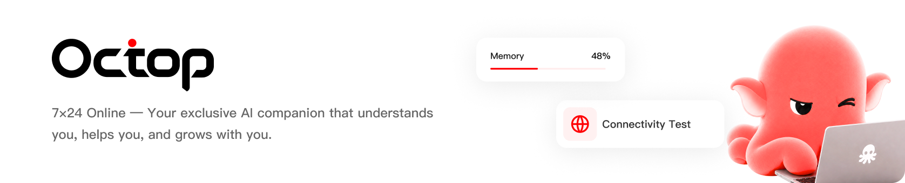
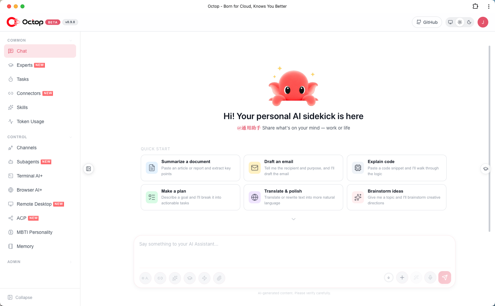

<p align="center">
  
</p>

<p align="center">
  <strong>Умный self-hosted AI-ассистент — multi-user, multi-agent.</strong>
</p>

<p align="center">
  <a href="https://trendshift.io/repositories/95504?utm_source=repository-badge&utm_medium=badge&utm_campaign=badge-repository-95504" target="_blank" rel="noopener noreferrer">
    
  </a>
</p>

<p align="center">
  <a href="https://www.python.org/downloads/"></a>
  <a href="https://github.com/TencentCloud/Octop/blob/main/LICENSE"></a>
  <a href="https://github.com/TencentCloud/Octop/releases"></a>
  <a href="https://pypi.org/project/octop/"></a>
  <a href="https://github.com/astral-sh/ruff"></a>
  <a href="https://github.com/TencentCloud/Octop"></a>
  <a href="https://github.com/TencentCloud/Octop/fork"></a>
  <a href="https://discord.gg/jPas5J8Ua"></a>
</p>

<p align="center">
  <a href="#-highlights">Highlights</a> ·
  <a href="#-overview">Overview</a> ·
  <a href="#-core-technology">Core Technology</a> ·
  <a href="#-features">Features</a> ·
  <a href="#-roadmap">Roadmap</a> ·
  <a href="#-quick-start">Quick Start</a> ·
  <a href="#-contents">Contents</a>
</p>

<p align="center">
  <a href="README.md">English</a> · <a href="README_CN.md">中文</a> · <b>Русский</b>
</p>

---

**Octop** — открытый self-hosted AI-ассистент. Это не просто инструмент, а цифровая «жизнь», которая может работать параллельно. Через multi-agent архитектуру он строит умную среду для команд, семей и отдельных пользователей: независимую и при этом совместную. Всё крутится на вашей машине — полностью self-hosted дизайн означает, что приватность не компромисс, а единый процесс сразу даёт web-консоль, CLI и IM-интеграции.

Общайтесь через Web Dashboard, Feishu, DingTalk, QQ, Discord, WeCom или программно через HTTP/SSE/WebSocket. Расширяйте возможности через **expert library**, **Connectors** (OAuth + MCP) и **ACP** для IDE-воркфлоу.

## ✨ Highlights

| | Функция | Описание |
|---|---------|-------------|
| 👥 | **Multi-user expert team** | Один admin, общий household; встроенная expert library — переключайте специалистов под задачу |
| 🎭 | **MBTI personas** | 16 шаблонов личности и интерактивный тест — у каждого агента свой характер |
| 🔒 | **Security built-in** | JWT-изоляция пользователей, tool approval, shell guardrails и PII redaction — данные локально |
| 🔌 | **Connector ecosystem** | Tencent suite (Docs, Weibo trends, News, …); OAuth и MCP gateway расширяют границы |
| 💾 | **Pluggable backends** | Локальный диск, Docker, PostgreSQL или COS/S3 — AI работает в изолированных границах |
| 🧠 | **Portable memory** | На базе harness-memory; память мигрирует вместе с workspace |
| 📚 | **Knowledge base** | RAG по вашим документам; семантический поиск опирает ответы на ваш корпус |
| 🧩 | **Plugins** | Расширяйте Octop сторонними плагинами; bundled-плагины включаются по необходимости |
| ↔️ | **ACP bidirectional** | `octop acp` для IDE/terminal AI; делегирование в OpenCode / Claude Code с permission gates |
| 💻 | **Terminal AI+** | Интерактивный shell в браузере — AI помогает выполнять команды и чинить проблемы |
| 🌐 | **Browser AI+** | Headless Chromium для web-автоматизации, скриншотов и удалённого браузинга |
| 🖥️ | **Remote desktop** | Живой экран и ввод с dashboard на Linux, Windows и macOS; one-click isolated desktop на headless Linux |
| 🏠 | **Self-hosted** | Dashboard, CLI, IM-каналы и cron в одном `octop run` — все данные в `~/.octop/` |

## 📌 Overview

Octop — self-hosted AI-платформа для домов и небольших команд. Один процесс обслуживает web dashboard, CLI, IM-каналы (Feishu, DingTalk, QQ, Discord, WeCom и др.) и cron — всё на одной control-plane БД в `~/.octop/` (SQLite по умолчанию; PostgreSQL опционально).

> Цель дизайна Octop: оставлять каждый диалог, workspace и credential на вашей машине и при этом давать каждому пользователю личную команду специализированных агентов.

<details>
<summary>🐾 Что можно делать с Octop</summary>

- **Личный ассистент** — weekly reports, заметки, расписание; память живёт с workspace.
- **Семейный sharing** — один admin на весь household; разные агенты и эксперты для членов семьи.
- **Командный helper** — несколько агентов параллельно; мост Feishu / DingTalk / WeCom в групповые чаты.
- **Для разработчиков** — делегирование в OpenCode / Claude Code через ACP или troubleshooting из терминала.
- **Web automation** — Browser AI+: формы, скриншоты, сбор публичной информации.
- **Scheduled tasks** — cron на естественном языке: агент пушит или запускает задачи вовремя.

</details>

## 🧠 Core Technology

| Layer | Technology |
|-------|-----------|
| **Language** | Python 3.12+ |
| **Web framework** | FastAPI + uvicorn |
| **Agent runtime** | harness-agent |
| **Gateway** | harness-gateway |
| **Control plane DB** | SQLite (WAL, default) или PostgreSQL (optional) |
| **Frontend** | React 18 + TypeScript + Vite + Ant Design |
| **Scheduling** | APScheduler |
| **ACP** | agent-client-protocol |
| **Build / quality** | hatchling · ruff · mypy · pytest |

Octop собран на стеке Harness — наборе runtime'ов в одном процессе:

- **harness-agent** — runtime агента: model routing, tools, skills, checkpointing диалогов.
- **harness-gateway** — мост IM-каналов, нормализующий входящие сообщения в единый pipeline.
- **harness-memory** — иерархический recall с full-text search; память едет с workspace.
- **harness-browser** — CDP browser automation с persistent profiles.

Вместо внешней очереди Octop проводит Web UI, IM и cron через один in-process `HarnessProcessor`. Один restart-safe процесс; состояние восстанавливается из control-plane БД при старте.

## 🤔 Features

### Server & auth
- Multi-user JWT с ролью admin
- Мастер первого запуска (`octop init`)
- Interactive API docs на `/api/docs` (выкл. по умолчанию — `"enable_api_docs": true` в `config.json`)

### Agents
- Несколько агентов на пользователя; у каждого свой workspace, providers, channels и cron
- 16 MBTI persona templates + свой system prompt
- Expert library сканируется при boot (`infra/agents/experts/library/`)
- Workspace backends: local disk, COS, S3 и другие remote stores

### Channels & automation
- IM: Feishu, DingTalk, QQ, Discord, WeCom и др.
- Proactive cron с natural-language и slash-command триггерами
- Единая обработка сообщений для Web UI, IM и cron

### Surfaces
- **Web dashboard** — chat, agents, connectors, channels, cron, settings
- **CLI** — `octop run`, `octop chat`, `octop acp`, admin-команды
- **HTTP/SSE/WebSocket API** — полный программный доступ

### Knowledge & plugins
- **Knowledge base** — RAG по документам; semantic retrieval опирает ответы на ваш корпус
- **Plugins** — `octop plugin`; bundled-плагины включаются из dashboard

### ACP (Agent Client Protocol)

Два направления:

1. **Inbound** — внешние инструменты используют **ваш** Octop-агент
   ```bash
   octop acp --agent main   # stdio ACP server for Zed, OpenCode, …
   ```

2. **Outbound** — Octop делегирует внешним coding-агентам
   - Dashboard → **ACP** (`/acp`): runners (глобально на пользователя)
   - Включите **acp_runner** у агента и делегируйте в чате

Built-in outbound runners: OpenCode, CodeBuddy, Claude Code, Codex.

Полная настройка: **[docs/acp.md](docs/acp.md)**.

## 🧭 Roadmap

Средне- и долгосрочные планы:

- [ ] **Shared resource pool** — общий пул skills и sub-agents для новых экспертов без сборки с нуля.
- [ ] **Expert sharing** — публикация экспертов другим пользователям того же деплоя.
- [ ] **Browser & terminal polishing** — recording browser-skill и более сильный terminal AI.
- [ ] **AgentTeams** — координатор сам оркестрирует несколько экспертов на multi-step задачи.
- [ ] **Self-evolution** — автодистилляция диалогов в reusable skills.
- [ ] **PC / mobile clients** — нативные desktop/mobile приложения рядом с web и IM.

Roadmap ориентировочный и может меняться.

## 🚀 Quick Start

### Prerequisites

- **macOS / Linux / Windows**
- Предустановленный Python не нужен — installer через [uv](https://docs.astral.sh/uv/) ставит Python 3.12 в изолированный venv под `~/.octop/`
- Современный multi-core CPU, несколько GB RAM, достаточно диска под БД, workspaces и документы

### 1. Install

**macOS / Linux** — one-line installer (рекомендуется):

```bash
curl -fsSL https://finnie-1258344699.cos.ap-guangzhou.myqcloud.com/octop/install.sh | bash
```

**Windows (PowerShell)**:

```powershell
irm https://finnie-1258344699.cos.ap-guangzhou.myqcloud.com/octop/install.ps1 | iex
```

**Windows (cmd)**:

```bat
curl -fsSL https://finnie-1258344699.cos.ap-guangzhou.myqcloud.com/octop/install.bat -o install.bat
install.bat
```

После установки откройте **новый терминал** или перезагрузите shell:

```bash
source ~/.zshrc   # Zsh
# or
source ~/.bashrc  # Bash
```

Installer кладёт `octop` в PATH через `~/.octop/bin`. Опциональные extras:

```bash
# Browser automation (Playwright Chromium)
curl -fsSL https://finnie-1258344699.cos.ap-guangzhou.myqcloud.com/octop/install.sh | bash -s -- --extras browser

# Feishu channel support
curl -fsSL https://finnie-1258344699.cos.ap-guangzhou.myqcloud.com/octop/install.sh | bash -s -- --extras channels-feishu
```

См. [scripts/README.md](scripts/README.md) для всех опций (`--version`, `--from-source`, `--mirror`, Windows flags).

**Desktop app** — артефакты с [GitHub Releases](https://github.com/TencentCloud/Octop/releases/latest):

| Platform | Artifact |
|----------|----------|
| Windows | `Octop-desktop-windows-amd64-<version>.exe` / `Octop-desktop-windows-arm64-<version>.exe` — NSIS |
| macOS | `Octop-desktop-darwin-arm64-<version>.dmg` / `Octop-desktop-darwin-amd64-<version>.dmg` |
| Linux | `Octop-desktop-linux-amd64-<version>.tar.gz` / `Octop-desktop-linux-arm64-<version>.tar.gz` |
| FnOS NAS | `Octop-fnos-docker-<version>.fpk` / `Octop-fnos-native-<version>.fpk` — через App Center |

См. [desktop/README.md](desktop/README.md) и [fnos/README.md](fnos/README.md).

**Alternative — PyPI**:

```bash
pip install octop
# optional: pip install "octop[browser]"
# optional local ONNX embedding: pip install "octop[local-embedding]"
```

Из source checkout с uv:

```bash
uv sync --extra local-embedding
```

### 2. Initialize

```bash
octop init
```

Интерактивный wizard создаёт SQLite, JWT secret и первого admin в `~/.octop/`.

### 3. Run

```bash
# Foreground (API + Web dashboard)
octop run

# Custom host / port
octop run --host 0.0.0.0 --port 8088

# Register as a system service (systemd / launchd / Windows service)
octop service start
```

Откройте **http://127.0.0.1:8088**. В Docker первый init генерирует случайный admin password (в `/data/.octop/credential.txt`), если не задан `OCTOP_DEFAULT_PASSWORD`. Interactive `octop init` просит пароль (≥8 символов, буквы и цифры).

### Docker (рекомендуется для production)

```bash
# Build and start
docker compose -f docker/docker-compose.yml up -d

# Or build manually
bash docker/docker_build.sh
docker run -d \
  -p 8088:8088 \
  -v octop-data:/data/.octop \
  -e HOME=/data \
  -e OCTOP_DEFAULT_PASSWORD="<strong-password-or-omit-for-random>" \
  octop:latest
```

Откройте `http://localhost:8088`. Credentials пишутся в `/data/.octop/credential.txt`. Username можно задать через `OCTOP_ADMIN_USERNAME`.

> **Password policy:** минимум 8 символов, буквы и цифры.

| Variable | Default | Description |
|----------|---------|-------------|
| `OCTOP_PORT` | `8088` | HTTP listen port |
| `OCTOP_DEFAULT_PASSWORD` | _(unset)_ | First-run admin password (Docker). Unset = random → `credential.txt` |
| `OCTOP_ADMIN_USERNAME` | `admin` | First-run admin username |
| `OCTOP_DATA` | `~/.octop` | Host data directory (compose bind mount) |

Полный список: [`.env.example`](.env.example).

## 📑 Contents

- [Highlights](#-highlights)
- [Overview](#-overview)
- [Core Technology](#-core-technology)
- [Features](#-features)
- [Roadmap](#-roadmap)
- [Quick Start](#-quick-start)
- **Deploy & Use**
  - [Install options](#-install-options)
  - [Configuration](#-configuration)
  - [CLI reference](#-cli-reference)
  - [Web dashboard](#-web-dashboard)
  - [Data directory](#-data-directory)
- **Architecture & Dev**
  - [Architecture](#-architecture)
  - [Project layout](#-project-layout)
  - [Development](#-development)
- **Project Info**
  - [Security & privacy](#-security--privacy)
  - [Contributing](#-contributing)
  - [Changelog](#-changelog)
  - [Related projects](#-related-projects)
  - [WeCom customer group](#-wecom-customer-group-cn)
  - [License](#-license)

## 📦 Install options

| Method | Platform | Description |
|--------|----------|-------------|
| Remote one-liner | macOS / Linux | `curl …/octop/install.sh \| bash` |
| Remote one-liner | Windows | `irm …/octop/install.ps1 \| iex` или `install.bat` |
| Local script | macOS / Linux | `bash scripts/install.sh` |
| Local script | Windows | `scripts\install.bat` или `install.ps1` |
| PyPI | Any | `pip install octop` или `pip install "octop[browser]"` |
| Docker | Any | `docker/docker-compose.yml` |

Скрипты ставят изолированное окружение в `~/.octop/venv` и wrapper `~/.octop/bin/octop` — system Python не трогают.

### Upgrade

`octop update` обновляет только wheel/binary — `~/.octop/` (БД, workspaces, secrets, `config.json`) сохраняется:

```bash
octop update          # fetch and install the latest octop, then restart the service if one is registered
```

Схема мигрирует при следующем boot; `octop init` — только если wizard просит. Перед cross-version upgrade делайте `octop backup`.

## ⚙️ Configuration

Всё runtime-состояние в `~/.octop/`. Управляйте через CLI или правьте файлы.

```bash
# LLM providers and models
octop models
octop provider list

# IM channels
octop channel list
octop channel install

# Skills (per agent)
octop skills list --agent main

# Cron jobs
octop cron list
octop cron create --help

# Users (admin)
octop user list
```

### Supported LLM providers

OpenAI-compatible APIs, DashScope (Qwen), Ollama и другие presets — настраиваются per agent в dashboard или через `octop provider`.

### Supported channels

| Channel | Credentials |
|---------|-------------|
| **Feishu** | App ID, App Secret |
| **DingTalk** | App Key, App Secret |
| **QQ** | Bot AppID, Token |
| **Discord** | Bot Token |
| **WeCom** | Corp ID, Agent Secret |
| **Web Dashboard** | Enabled by default |

## 📖 CLI reference

| Command | Description |
|---------|-------------|
| `octop init` | Bootstrap `~/.octop/` (DB, admin, JWT secret) |
| `octop run` | Start Octop in the foreground |
| `octop service start` | Install and start as a system service |
| `octop service stop` | Stop the system service |
| `octop agent` | Create, list, start/stop agents |
| `octop channel` | Install and manage IM channels |
| `octop chats` | REPL and session management |
| `octop acp` | Stdio ACP server for IDE integration |
| `octop cron` | Manage scheduled tasks |
| `octop models` | Provider presets and model resolution |
| `octop skills` | Enable/disable per-agent skills |
| `octop plugin` | Install and manage third-party plugins |
| `octop backup` | Export / restore backups |
| `octop clean` | Remove CLI state or wipe `~/.octop/` |
| `octop update` | Check for and install updates |

Полный справочник: **[docs/cli.md](docs/cli.md)**.

## 🖥️ Web dashboard

После `octop run` откройте **http://127.0.0.1:8088**.

<p align="center">
  
</p>

- **Chat** — real-time диалог с агентами
- **Agents** — создание агентов, experts / MBTI, providers
- **Connectors** — OAuth apps и MCP gateways
- **Channels** — настройка IM
- **Cron** — визуальное управление cron
- **Knowledge base** — корпуса документов и semantic retrieval
- **Plugins** — установка и конфигурация плагинов
- **ACP** — outbound coding-agent runners
- **Settings** — users, security, TLS, system

API docs: **http://127.0.0.1:8088/api/docs** (по умолчанию выкл. — `"enable_api_docs": true` в `config.json`)

## 📁 Data directory

```
~/.octop/                          ← install & data root
├── config.json                    # process config (optional database section)
├── octop.db                       # SQLite — users, agents, channels, cron, …
├── secrets/                       # JWT secret, channel tokens
├── agents/<agent_id>/             # per-agent workspace (SOUL.md, skills, …)
├── security/tool_guard/           # shell command allow/deny rules
├── logs/                          # runtime logs
├── venv/                          # uv-managed Python (installer layout)
└── bin/octop                      # PATH wrapper → venv/bin/octop
```

Control plane может использовать PostgreSQL — `database` в `config.json`, или `OCTOP_DATABASE_*` / wizard. С PostgreSQL память агента по умолчанию переиспользует тот же DSN; для file-based memory: `"memory": { "backend": { "type": "sqlite" } }`. См. [docs/configuration.md](docs/configuration.md) и [docs/adr/002-database-backends.md](docs/adr/002-database-backends.md).

## 🏗️ Architecture

```
OctopServer
 ├─ DatabasePool            SQLite (WAL) or PostgreSQL
 ├─ SharedServices       DI root — every repo + config
 ├─ ExpertCatalog        scans agents/experts/library/ at boot
 ├─ UserManager
 │   └─ HarnessAgentManager (per user)
 │       └─ AgentRuntime (per agent)
 │           ├─ HarnessAgent      Agent runtime (harness-agent)
 │           ├─ HarnessProcessor  IM / UI / cron entry point
 │           ├─ ChannelManager    IM connections (harness-gateway)
 │           └─ CronManager       APScheduler
 └─ FastAPI app (uvicorn)
```

Один процесс. Restart восстанавливает состояние из control-plane БД.

См. [docs/architecture.md](docs/architecture.md), [docs/adr/001-single-process-model.md](docs/adr/001-single-process-model.md), [docs/adr/002-database-backends.md](docs/adr/002-database-backends.md).

## 📁 Project layout

```
src/octop/
  config.py    env-var config
  launch.py    OctopServer boot + uvicorn
  infra/       business core (agents, gateway, cron, db, users, …)
  api/         HTTP layer — FastAPI app, routers, JWT, SSE
  cli/         CLI layer — Click commands
  dashboard/   built React SPA (wheel artifact)

dashboard/     frontend source (Vite) — edit here, run make build-frontend

docker/        Docker Compose, entrypoint, build & deploy scripts
tests/         unit/ + integration/
```

## 🛠️ Development

**Prerequisites:** Python 3.12+, Node 18+, [uv](https://docs.astral.sh/uv/)

```bash
# Backend
make install          # pip install -e ".[dev]"
make all              # format-all + lint + typecheck + test (ship bar)

# Frontend (separate terminal)
make dev-frontend     # Vite dev server on :5173 (override with VITE_DEV_PORT)
make build-frontend   # production build → src/octop/dashboard/
cd dashboard && npx tsc -b
```

Отдельные targets: `make test`, `make lint`, `make typecheck`, `make format`.

## 🔒 Security & privacy

- **Local-first**: config, чаты, workspaces и credentials в `~/.octop/` на вашей машине.
- **Multi-user isolation**: JWT с per-user агентами и workspaces.
- **PII redaction & tool approval**: чувствительные данные редактируются; рискованные tools/shell требуют approval.
- **Tool guardrails**: редактируемые правила shell в `~/.octop/security/tool_guard/`.
- **No vendor lock-in**: меняйте LLM providers, storage и channels без переписывания агентов.

## 🤝 Contributing

Контрибьюции приветствуются:

1. Fork репозитория
2. Feature branch (`git checkout -b feature/amazing-feature`)
3. Перед PR: `make all` (backend) или `make check-all` (full stack)
4. Откройте Pull Request

См. [CONTRIBUTING.md](CONTRIBUTING.md). Security: [SECURITY.md](SECURITY.md). Конвенции: [AGENTS.md](AGENTS.md).

## 📋 Changelog

См. [CHANGELOG.md](CHANGELOG.md).

## 🔗 Related projects

| Project | Description |
|---------|-------------|
| harness-agent | Agent runtime — model routing, tools, skills, checkpointing |
| harness-gateway | Multi-platform IM channel bridge |
| harness-memory | Hierarchical recall and FTS search |
| harness-browser | CDP browser automation with persistent profiles |

> Эти `harness-*` проекты готовятся к open-source; ссылки появятся после публикации.

## 💬 WeCom Customer Group (CN)

Для WeCom support group отсканируйте:

<p align="center">
  
</p>

> Отсканируйте QR-код, чтобы вступить в группу. По вопросам обращайтесь к admin группы.

## 📄 License

Проект под [MIT License](LICENSE).

## ✨ Contributors

Спасибо всем контрибьюторам:

<a href="https://github.com/tencentcloud/octop/graphs/contributors">
  
</a>
