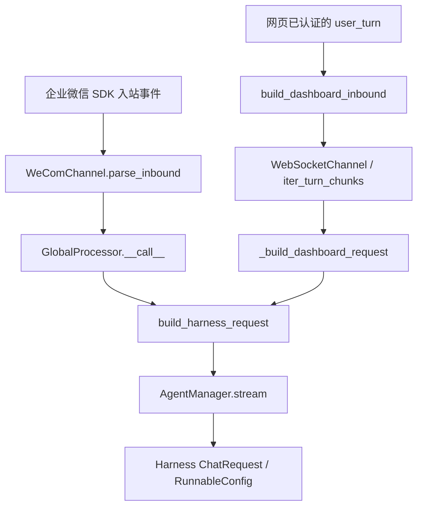

**WeCom 消息来源与真实发送者核查报告**

2026-09-18 实施更新：已按后续要求打通 WeCom 适配器 → Octop 请求 → harness 运行时 → 专家模型上下文。下文原核查记录中的“缺少独立身份上下文”已由本次实现修复；原记录保留用于说明问题起因，行号对应修改前的 `83378876`。

当前实现使用真实 WeCom 适配器已经生成的 `metadata.to_handle` 和 `channel_subject.subject_id`，校验两者为有效且一致的发送者标识。身份经 `build_inbound_context()` 标准化，通过 `build_harness_request(inbound_context=...)` 放入 `configurable.octop_inbound_context`；网页入口也生成本轮来源上下文，但不会获得 WeCom 发送者身份。既有 `source` 和 Octop `user` 的语义保持不变。

实际请求示例：

```json
{
  "source": "wecom/channel-example",
  "user": "1",
  "configurable": {
    "octop_inbound_context": {
      "channel_type": "wecom",
      "channel_id": "channel-example",
      "octop_user_id": 1,
      "sender": {
        "namespace": "wecom:channel-example",
        "id": "platform-user-example"
      },
      "chat_type": "dm",
      "conversation_id": "platform-user-example",
      "message_id": "message-example",
      "locale": "zh"
    }
  }
}
```

身份缺失、空白、`unknown`、适配器字段不一致或来源为网页时，`sender` 为 `null`。正文、自报用户名、`KHT_CALLER`、显式会话键以及 metadata 中自报的身份对象不参与身份提取。仅投影允许的字段，不透传 `_frame`、`_ws_client`、回复 URL 或其他原始数据。

`InboundContextMiddleware` 已注册到专家运行时。它在每次模型调用时读取当前运行配置，将上述对象和说明注入该次调用的系统消息；说明区分平台发送者与 Octop 所有者，要求不得用正文或历史推断缺失身份。说明提供中英文版本。上下文不追加到聊天历史，也不缓存在专家实例上；无入站上下文的调用明确显示 `null`。

| 实施位置 | 作用 |
| --- | --- |
| `src/octop/infra/gateway/process/inbound_context.py` | 定义上下文结构，按现有 WeCom 适配器契约提取身份。 |
| `src/octop/infra/gateway/process/harness_request.py` | 普通文本、多模态、显式 messages 三种请求均携带独立上下文。 |
| `src/octop/infra/gateway/process/processor.py` | IM 和网页请求分别注入各自真实的本轮上下文。 |
| `src/octop/infra/agents/middleware/inbound_context.py` | 将当前上下文提供给专家模型，保留原系统消息和聊天内容。 |
| `src/octop/infra/agents/manager.py` | 注册中间件，使实际专家运行时启用上述注入。 |
| `src/octop/i18n/en.json`、`src/octop/i18n/zh.json` | 当前入站上下文说明。 |

目前已通过 107 项专项测试，包含真实 WeCom 适配器解析、IM 处理器请求传递、harness 配置转换、真实 LangGraph 图执行、专家中间件注册和 i18n 校验。图执行使用本地假模型，无外部 LLM 调用；验证同一会话中 Alice → Bob → dashboard 的身份切换及系统身份说明不写入历史。执行命令：

```powershell
uv run pytest tests/unit/gateway/test_inbound_context.py tests/unit/agents/test_inbound_context_middleware.py tests/unit/gateway/test_processor_default_open.py tests/unit/gateway/test_message_keys.py tests/unit/gateway/test_harness_request.py tests/unit/i18n tests/unit/agents/test_agent_manager.py::test_build_harness_config_includes_inbound_context_middleware -q
```

本次已在项目忽略目录 `.tools/bootstrap` 安装本地 uv，并通过 `uv sync --frozen` 创建 `.venv`，未更改锁文件。完整检查已通过：后端 Ruff 检查通过，1002 个 Python 文件格式检查通过，mypy 检查 496 个源文件通过，测试结果为 **3214 passed、111 skipped**。完整 `make all` 使用本机 GNU Make 的 Windows 可执行名称 `mingw32-make` 和 Git Bash 运行，命令如下：

```powershell
$env:PYTHONUTF8 = '1'
$env:PATH = 'D:\Projects\Octop\.tools\bootstrap\bin;D:\Git\usr\bin;' + $env:PATH
mingw32-make all SHELL=D:/Git/bin/bash.exe REPO_ROOT=D:/Projects/Octop PYTEST_JOBS=8
```

首次未启用 UTF-8 模式时，全量结果为 3194 passed、19 failed、112 skipped。19 个失败均为原有数据库／备份测试使用默认 GBK 编码读取 UTF-8 SQL 文件导致的 `UnicodeDecodeError`。在修改前 `83378876` 的独立工作树中复跑同一组用例，19 个失败全部复现；启用 `PYTHONUTF8=1` 后上述完整检查通过。没有为此修改无关数据库代码或测试。基线工作树已清理，完整检查产生的无关前端格式变化也已恢复。

本地验证日志保存在 `.tools/wecom-make-all-utf8.log`，基线对照日志保存在 `.tools/wecom-baseline-tests.log`。部署后需重启 Octop，使专家运行时加载新增的上下文中间件。

本次实现交付的是身份传递与专家可见性。`sender` 非空不表示已取得业务权限；具体业务工具仍需从该服务器上下文执行自己的授权校验。未添加通用业务拒绝规则、权限名单或 `KHT_CALLER` 环境变量注入，也未更改会话归属及依赖源码。真实企业微信在线收发仍需在已配置机器人的环境验收。

以下为实施前核查记录：核查日期为 2026-09-18，代码基线为 `83378876`；该阶段仅分析实现并提出修改建议，未修改业务代码。

核查结论是：**问题部分属实。当前实现确实缺少供专家及业务工具使用的、逐条消息绑定的独立发送者身份上下文；但没有证据证明正常 WeCom 入站会被统一改写成 `dashboard/octop-dashboard`。** 当前源码与隔离验证均显示，正常 WeCom 请求保留 `wecom/<实际通道ID>`。用户看到的 dashboard 来源还需要用发生问题的那一轮运行记录定位，不能只根据专家生成的回答判定底层通道被改写。

用户补充的测试要求为：先确认消息来自企业微信，再从 gateway 入站数据取得真实发送者；身份不明确即拒绝；不接受聊天正文自报用户名或 `KHT_CALLER`。这要求后端拥有并执行身份校验，仅在专家提示词中写“硬性门禁”不足以保证上述行为。

| 待核实的判断 | 核查结果 | 说明 |
| --- | --- | --- |
| 真实 WeCom 入站被固定写成 dashboard | 尚未证实，正常代码路径有相反证据 | IM 处理器直接使用当前 `msg.channel_type`、`msg.channel_id` 生成来源。 |
| dashboard 的 sender 恒为 `user=1` | 不是代码中的固定规则 | `user` 来自已认证的 Octop 登录账号；账号 ID 为 42 时得到 `user="42"`。 |
| WeCom 不同发送者也可能都显示 `user=1` | 属实，有意使用的账号归属语义 | 外部 IM 的 `user` 使用专家所有者的 Octop 用户 ID；所有者为 1 时，不同企业微信成员都会得到 `user="1"`。 |
| WeCom 适配器没有获取真实发送者 | 不属实 | 锁定版本会读取企业微信事件的 `from.userid`，并兼容 `from.user_id`。 |
| 当前专家请求具备完整、独立的 gateway 发送者上下文 | 不具备 | 请求传递 `source`、Octop `user`、`session_key` 等，但没有独立的真实发送者字段，也没有整体透传入站 metadata。 |
| 现有通用链路实现了“身份不明即拒绝”的业务门禁 | 未发现该实现 | 适配器在发送者字段缺失时可产生 `unknown`，通用 IM 入口没有对应的业务身份拒绝步骤。安装在运行环境中的自定义专家、插件或外部业务服务不在本次现场验证范围内。 |

这份报告中的“消息来源”指传给 harness 的 `source`；“真实发送者”指平台事件确认的企业微信成员标识；“消息类型”如 `msgtype=text/image` 是内容类型，三者应分别处理。

当前调用链如下，企业微信机器人本身也通过 WebSocket 接入，但它使用的是 `WeComChannel`，与网页聊天使用的 `WebSocketChannel` 是两个不同实现。



首先，WeCom 通道注册保持通道种类和实际 ID。`src/octop/infra/gateway/gateway.py:643` 调用 `manager.add_channel(row.kind, config, tenant_id=row.agent_id, channel_id=row.channel_id, ...)`。这里 `tenant_id` 绑定的是专家 ID，不应将其解释成企业微信企业 ID。

项目没有内置 WeCom 协议适配器源码，实现来自依赖。为避免只检查 Octop 包装层，本次下载并校验了 `uv.lock` 对应 wheel 的 SHA-256，读取了 `harness-gateway==0.9.7`、`orcakit-harness-agent==1.0.9` 的相关源码，也下载校验了 `harness-memory==0.9.10`。这些源码只解压到系统临时目录，没有安装或改写项目依赖。锁文件版本不等于用户服务器实际运行版本，现场仍需核对。

`harness-gateway==0.9.7` 中的具体证据是：

| 依赖内路径 | 行号 | 行为 |
| --- | --- | --- |
| `harness_gateway/channels/wecom.py` | 71 | `WeComChannel.channel_type = "wecom"`。 |
| `harness_gateway/channels/wecom.py` | 562 | 读取 `data["from"]` 中的 `userid`，兼容 `user_id`；缺失时可能得到 `unknown` 或空值。 |
| `harness_gateway/channels/wecom.py` | 638 | 构造 `InboundMessage`，保留当前 WeCom 通道类型和通道 ID。 |
| `harness_gateway/channels/wecom.py` | 642 | `channel_subject.subject_id` 存入本条消息的发送者 ID。 |
| `harness_gateway/channels/wecom.py` | 645 | metadata 含 `to_handle`、`chat_id`、`chat_type`、`msgid` 及临时回复上下文；其中 `to_handle` 来自上述发送者 ID。 |
| `harness_gateway/channels/wecom.py` | 399 | 将该消息交给 `_processor(message)`，没有转入网页聊天入口。 |

因此，针对本次锁定的 WeCom 版本，若专家或自定义工具只查找 `metadata.sender_id`，会找不到真实身份：适配器当前使用的是 `metadata.to_handle`，并没有生成统一的 `metadata.sender_id`。`to_handle` 在这里能追溯到 `from.userid`，不意味着所有通道的同名字段都代表真实发送者；统一身份解析必须遵守各通道的契约。

其次，Octop 的来源生成逻辑没有把 IM 强制变成 dashboard。`src/octop/infra/gateway/process/processor.py:837` 的 IM 请求构建明确传入：

```python
request = build_harness_request(
    thread_id=thread_id,
    user_id=user_id,
    agent_id=agent_id,
    session_key=session_key,
    source=f"{msg.channel_type}/{msg.channel_id}",
    content=content,
    model=model_ref,
    message_kwargs=message_kwargs,
)
```

`src/octop/infra/gateway/process/processor.py:1206` 的 `_build_dashboard_request()` 也按当前消息生成 `source`，而不是把字符串固定成 dashboard。仅凭这个函数的名字，不能认定来源被改写。

`src/octop/infra/agents/manager.py:1045` 将请求传入 harness；`src/octop/infra/agents/manager.py:2619` 的准备步骤补充专家和插件配置，没有把 WeCom 来源替换成 dashboard。底层 `orcakit-harness-agent==1.0.9` 的 `harness_agent/request.py:107` 将 `source` 和 `user` 放进 `RunnableConfig.configurable`；`harness_agent/middleware/memory.py:837` 将这两个字段用于会话 JSONL 记录。

这也说明，**运行时配置或日志里存在 `source`，不等于模型本轮已经收到了可信的身份说明**。在本次检查的默认路径中，未发现把完整 gateway 入站身份自动注入模型上下文的步骤。若专家是通过历史文件、先前对话或自行推断回答“消息来源”，其回答不能替代本轮后端请求证据。

第三，`user=1` 的实际含义与企业微信身份不同。`src/octop/infra/gateway/process/message_keys.py:79` 的 `resolve_user_id_for_message()` 明确区分：

- dashboard、CLI：将 `channel_subject.subject_id` 解析为 Octop 用户 ID。
- 外部 IM：使用专家所有者的 Octop 用户 ID，即使平台 ID 恰好是数字，也不将其视为 Octop 用户 ID。
- 无有效所有者时返回 0，而不是企业微信身份。

`src/octop/infra/gateway/process/harness_request.py:305` 再把该值转为字符串写入请求的 `user`。假设专家所有者为 Octop 用户 1，那么企业微信成员 Alice 和 Bob 的请求都会带 `user="1"`。这个字段用于当前系统的账号归属，不能直接用于判断企业微信业务操作人。直接将它替换成企业微信 UserID 会改变既有账号、资源及工具配置语义，不建议这样修复。

网页路径也没有把用户写死为 1。`src/octop/api/routers/chat/ws.py:159` 将已认证的 `user.id` 传给 `build_dashboard_inbound()`；`src/octop/api/routers/chat/turn.py:341` 将来源固定为网页通道，并把这个用户 ID 放入 subject。`octop-dashboard` 常量定义在 `src/octop/infra/gateway/ws/ws_channel.py:29`。因此，在同一个 ID 为 1 的账号下反复网页测试，持续看到 `user=1` 是符合实现的。

第四，已经确认的信息缺口发生在入站消息转换成专家请求的过程中：

| 层次 | 当前保留的信息 | 对门禁的限制 |
| --- | --- | --- |
| 原始 WeCom 入站消息 | 当前平台发送者、通道、聊天信息、消息 ID、临时回复上下文 | 是提取身份的起点；必须确认来自真实适配器及已配置通道。 |
| 会话路由 metadata | `sanitize_im_metadata()` 保留白名单，例如 `to_handle`、`chat_id`、`chat_type` | 服务于会话和主动推送，不是逐条消息授权凭据。 |
| Harness 请求 | `source`、Octop `user`、`agent_id`、`thread_id`、`configurable.session_key` 等 | 没有独立、标准化的当前平台发送者上下文。 |
| 模型可见消息 | 正文、附件及部分群聊背景说明 | 不具备可据以完成硬性授权的身份契约。 |

具体位置为 `src/octop/infra/gateway/process/message_keys.py:143` 的持久化白名单、同文件 `:166` 的 `sanitize_im_metadata()`、`src/octop/infra/gateway/process/processor.py:790` 的会话写入，以及 `src/octop/infra/gateway/process/harness_request.py:255` 的请求构建器。当前构建器没有入站身份参数，普通 IM 调用也没有将入站 metadata 作为请求 metadata 传入。

需要保留一个细节：默认 `session_key` 按 `agent:channel:subject:chat_type` 构造，因此可能间接包含 WeCom 发送者 ID；不能说所有标识都被彻底丢弃。但它是会话路由键，支持显式指定和重绑定，不是本轮发送者的标准身份接口。群聊里还必须区分会话主体与具体发言者。业务门禁不应解析会话键来猜测操作人。

`_group_turn_text()` 在 `src/octop/infra/gateway/process/harness_request.py:29` 会为群聊正文增加背景和发送者标签，其中 `:85` 读取 `metadata.sender_id/sender_name`。这种面向模型的显示逻辑既不是授权检查，也不能弥补锁定版本 WeCom 没有统一 `sender_id` 字段的问题。

对于用户观察到的 `dashboard/octop-dashboard`，目前可以给出以下定位方向，但不能把任意一项当成已确认的现场根因：

1. **实际执行的是网页新一轮消息。** 为专家绑定 WeCom 通道，不会改变网页发信的真实来源。`src/octop/api/routers/chat/turn.py:60` 支持为已有 thread 准备网页请求，而 `:341` 仍构造 dashboard 入站；所以在网页里打开来自 IM 的历史会话后继续发送，本轮来源仍应是 dashboard。单纯查看历史不会生成一条新的网页用户消息。
2. **专家使用了历史来源或推断。** 同一个会话、工作区或记忆中可能存在之前的网页记录；应核对本轮请求，而不是使用历史中的第一条来源、最近文件中的任意来源或专家自述。
3. **部署与本次代码基线不一致，或有自定义接入。** 若真实企业微信事件到达 Octop 后，本轮请求确实记录为 dashboard，则需检查实际依赖版本、自定义转发器、插件，以及是否错误调用了网页入站构建器。

建议通过同一条测试消息的时间、平台 `msgid` 和 thread 标识关联以下三处，定位来源第一次发生变化的位置：适配器解析后的 `InboundMessage`；IM 处理器调用 `build_harness_request()` 前；进入 harness 的最终请求／运行时配置。必要时再检查该轮模型实际收到的上下文。日志只记录诊断所需的通道、请求关联字段和经过适当处理的发送者标识，不输出正文、凭据、`response_url`、`_frame`、客户端对象或媒体解密信息。缺少这组证据时，不建议把“专家回答 dashboard”直接登记为已复现的通道路由 bug。

修改应围绕已经证实的身份契约缺失进行，优先保留现有 `source` 与 Octop `user` 的语义。以下为建议方案，字段名是拟新增设计，不是当前已经存在的 API。

1. **在 infra 入站处理处统一提取当前消息身份。** 可在 `src/octop/infra/gateway/process/message_keys.py` 或同目录的小型专用模块中增加身份规范化函数，由 IM 与网页处理入口共用。输入是可信入口构建的 `InboundMessage` 及已校验的通道绑定，输出明确的身份上下文。WeCom 当前版本从适配器产出的 `to_handle`／subject 提取并校验一致性，长期可推动 gateway 适配器标准化 `sender_id`。字段为空、`unknown` 或相互矛盾时必须判定身份不明，不能回退到 `user=1`、昵称、群 ID 或聊天正文。
2. **通过独立的请求上下文传给运行时。** 扩展 `build_harness_request()`，例如写入服务器构造的 `configurable.octop_inbound_context`，并保留原有 `user` 供 Octop 账号归属使用。不要透传全部原始 metadata；只传通道、消息关联、发送者、会话范围等必要字段。企业微信身份应至少绑定通道实例或已验证的企业／机器人命名空间，不能假定 UserID 在所有企业之间全局唯一，也不能把专家 `tenant_id` 当企业 ID。
3. **让专家读取本轮身份，但让后端执行门禁。** 如需专家解释当前来源，可增加由后端注入的上下文说明或只读工具。真正受限的业务工具／服务必须直接读取服务器持有的本轮身份，检查允许的 WeCom 通道、通道与专家绑定、有效发送者和业务授权。检查失败就在敏感操作执行前拒绝，不能以模型“已经检查”为放行依据。逻辑应放在 `infra/` 的工具／业务服务层，不在 HTTP 路由或提示词里重复实现。
4. **按消息和调用绑定身份，覆盖恢复与委派。** 每轮重新提取，不把上轮授权保存在共享专家实例或会话 metadata 中供下轮复用。HITL 恢复、专家间委派、异步任务执行都需要明确原始请求人和当前操作人的来源；上下文缺失或不能证明授权继承时拒绝相关业务操作。不要让网页继续会话、群成员切换或其他专家调用继承先前 WeCom 用户的权限。

可供评审的最小上下文示例：

```json
{
  "source": "wecom/channel-example",
  "user": "1",
  "configurable": {
    "octop_inbound_context": {
      "channel_type": "wecom",
      "channel_id": "channel-example",
      "octop_user_id": 1,
      "sender": {
        "namespace": "wecom:channel-example",
        "id": "platform-user-example"
      },
      "chat_type": "dm",
      "conversation_id": "conversation-example",
      "message_id": "message-example"
    }
  }
}
```

这个结构本身不是认证凭据。安全性来自后端确保它只能由真实入站链路创建，并在业务执行时保持与该轮请求的绑定。`channel_type="wecom"` 字符串、某个 `verified=true` 标志，或同样格式的聊天文本都不能单独证明身份。若沿用 harness 的 `configurable`，还应保护保留字段不被客户端、模型工具参数或后续配置合并覆盖；其 `ChatRequest.to_runnable_config()` 当前允许显式 configurable 覆盖自动注入的同名字段。

对于 `KHT_CALLER`，本次在项目源码中未检索到相应的内置门禁实现。如果外部业务工具使用该值，应由工具内部从已验证的请求上下文解析调用者；聊天正文、模型提供的工具参数、用户可改的环境变量都不能赋予权限。不要让模型通过 shell 自设 `KHT_CALLER` 后调用受限业务。如果业务凭据同时可以被通用执行工具直接使用，还需让实际业务服务也执行相同的身份授权，避免只拦截某一个工具入口。

不建议通过下面几种方式处理本问题：

- 把绑定了 WeCom 的专家的所有消息都标成 WeCom；这会把网页调用伪装成允许的来源。
- 将 `request.user` 全局改成企业微信 UserID；这会混淆 Octop 用户与平台身份。
- 只给提示词增加“你现在位于企业微信”，或者要求用户在正文填写用户名；这些信息不能用于授权。
- 只往会话推送 metadata 的白名单里增加 `sender_id`；它无法解决逐条请求传递、模型可见性以及业务执行前的强制校验。
- 将 `_frame`、`_ws_client`、回复 URL 等原始 metadata 全部交给模型。

本次验证使用当前源码函数做了五个隔离用例。由于完整运行依赖不可用，通过 Python AST 提取原函数体执行，使用锁定版本 gateway 的真实消息模型，并替代了通道实例、登录账号等外部环境；来源表达式取自 `GlobalProcessor.__call__`，同时验证了 harness 的 `to_runnable_config()` 保持来源不变。没有启动真实机器人、调用模型、操作业务数据，也没有执行完整 GlobalProcessor 生命周期。

| 隔离输入 | 适配器得到的发送者 | Harness `source` | Harness `user` | 独立发送者上下文 |
| --- | --- | --- | --- | --- |
| WeCom，`from.userid=alice-test`，专家所有者 1 | `alice-test` | `wecom/wecom-audit` | `"1"` | 无 |
| WeCom，`from.userid=bob-test`，专家所有者 1 | `bob-test` | `wecom/wecom-audit` | `"1"` | 无 |
| WeCom，缺少 `from` 中的用户字段 | `unknown` | `wecom/wecom-audit` | `"1"` | 无 |
| 网页账号 1，正文自报 WeCom／`KHT_CALLER` | Octop subject 为 `1` | `dashboard/octop-dashboard` | `"1"` | 无 |
| 网页账号 42，同样正文 | Octop subject 为 `42` | `dashboard/octop-dashboard` | `"42"` | 无 |

五个用例的断言均通过。前两例也验证 `sanitize_im_metadata()` 保留 `to_handle`；第三例证明这些转换函数不会自行拒绝 `unknown`。最后两例证明自报文本不会改变这条网页请求构建链中的来源和账号值，不代表已验证模型或全部业务工具抵抗伪造身份的能力。

验证命令与限制如下：

| 命令／检查 | 结果 |
| --- | --- |
| `git rev-parse --short HEAD` | `83378876`。 |
| 锁文件指定 wheel 下载与 SHA-256 校验 | 三个依赖均通过。 |
| `python -` 执行上述原函数隔离探针 | 五个用例通过；不是端到端测试或完整 pytest 结果。 |
| `uv run pytest tests/unit/gateway/test_message_keys.py tests/unit/gateway/test_harness_request.py -q` | 未能启动：当前环境没有 `uv` 命令。 |
| `make all` | 未能启动：当前环境没有 `make` 命令；默认 Python 环境也未安装 harness 运行依赖。 |

因此，本报告不声称全套测试通过，也不声称已在用户部署环境复现原始来源误判。业务代码保持不变，交付物是这份分析文档。

后续实现建议至少包含以下验收用例，执行项目的 `make all`；涉及新增用户可见拒绝文案时，补齐中英文 i18n 并执行 `uv run pytest tests/unit/i18n -q`。

| 验收场景 | 期望结果 |
| --- | --- |
| 真实 WeCom 单聊，已授权成员 | 来源保持实际 WeCom 通道；真实发送者逐轮传入，业务允许。 |
| 同一专家下两个不同 WeCom 成员 | Octop `user` 可相同，但业务发送者独立，授权不能串用。 |
| 有效成员与未授权成员交替发消息 | 未授权成员不继承前一人的结果或权限。 |
| 缺失、空白、`unknown` 或身份字段冲突 | 在敏感工具／业务调用前拒绝，且不调用实际下游操作。 |
| 网页账号 1 与其他网页账号 | 来源始终为 dashboard，触发“仅限 WeCom”的拒绝。 |
| 网页打开 WeCom 历史后发送新消息 | 本轮仍为 dashboard，不继承历史 WeCom 身份。 |
| 正文或工具参数伪造用户名、`KHT_CALLER`、来源或上下文 JSON | 不影响服务器确认的身份和授权结果。 |
| 群聊、不同群中的同一成员、不同企业／通道中的同名成员 | 正确区分会话、真实发言者和身份命名空间。 |
| HITL 恢复、专家委派及异步执行 | 身份与授权绑定清晰；无法验证时拒绝。 |
| 敏感工具失败拒绝路径 | 确认下游服务没有被调用，并记录可关联的拒绝原因。 |

修复优先级应是先补齐本轮真实身份契约与业务强制校验，再依据现场链路证据决定是否需要修复额外的来源覆盖问题。无需为此改变网页消息应当来自 dashboard 的正常行为。
