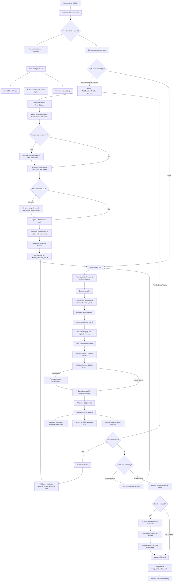

# LongMemEval Memory Agent Data Flow

No embedding model or reranker is used in this pipeline.

## Smoke Result

Initial balanced run with one episode per type and `glm-5.2`:

| Question type | Result | Diagnosis |
|---|---:|---|
| temporal-reasoning | 0 | Model ended with reasoning only after two searches. |
| multi-session | 0 | All three evidence sessions were retrieved, but the reader merged return and pickup events and answered 2 instead of 3. |
| knowledge-update | 1 | Correctly answered `25:50`. |

Initial accuracy: `1/3 = 0.3333`.

After adding reasoning-only continuation recovery, the same temporal episode used
two `MemorySearch` calls and two `MemoryRead` calls, reconstructed the January 8
and January 15 event anchors, answered `7 days`, and passed the independent judge.

The adjusted diagnostic result is therefore `2/3`, but it is not reported as a
single untouched benchmark run because the temporal item was rerun after a runtime fix.

## Runtime Verification

- Post-injection compression triggered online on the temporal episode:
  `90,732` characters after memory injection were reduced to `73,236` under a
  `90,000` final budget.
- A real Evidence Reader Subagent completed online on the multi-session episode:
  parent `2` turns; child `3` turns; child tools `MemorySearch`, `MemorySearch`,
  and `MemoryRead`; both `subagent_start` and `subagent_end` were persisted.
- The subagent still answered `2` instead of benchmark answer `3`. It grouped two
  Zara mentions as one physical pair of boots, while the benchmark expects the
  return and replacement pickup to be counted as separate pending actions. This
  is now an event/action-ledger semantics issue, not a missing-evidence or
  subagent-execution issue.

## Structured Ledger Result

The event/action-ledger path now separates physical entities from actions:

- entities: boots and navy blazer (`2`)
- actions: return old boots, pick up replacement boots, pick up blazer (`3`)
- explicit action provenance: `answer_afa9873b_3`, quote
  `I need to return some boots to Zara, actually`

Latest real TokenHub regression (`glm-5.2`, question `0a995998`):

| Signal | Result |
|---|---:|
| `report_valid` | `true` |
| `derived_decision.count` | `3` |
| Parent model's original count | `2` |
| `answer_guard_applied` | `true` |
| Final hypothesis | `3` |
| Reference answer | `3` |

Run artifact:
`work/eval-runs/agent-lab-ledger-v10-final/qa-agent-lab.jsonl`.

This result closes the original Zara failure end to end. It is one targeted
episode, not yet evidence of an aggregate LongMemEval improvement; the next step
is a balanced multi-session and temporal batch to measure generalization and
false-positive reconciliation risk.

## Bundle-First Reader Result

The second reader phase replaced repeated full-session injection inside the
subagent with a bounded, source-clustered evidence bundle. An offline balanced
15-episode diagnostic reached `0.967` mean answer-source recall with an average
bundle size of `10,356` characters at `k=14`.

A clean online regression on the three previous multi-session failures produced
the correct answers `3`, `2`, and `5`; the independent `glm-5.2` judge scored
`3/3 = 1.00`. This is a targeted regression result, not a full benchmark SR.

See `docs/phase-2-reader-results.md` for artifacts and failure-level details.

## Balanced 10-Episode Result

A subsequent balanced run evaluated five `temporal-reasoning` and five
`multi-session` episodes with an independent `glm-5.2` LongMemEval judge.

| Slice | Correct | SR |
|---|---:|---:|
| temporal-reasoning | 5 / 5 | 1.00 |
| multi-session | 2 / 5 | 0.40 |
| overall | 7 / 10 | 0.70 |

One multi-session episode failed with a TokenHub HTTP 400 provider-format error;
including it as incorrect gives the official `0.70` SR. Conditional on the nine
completed episodes, accuracy was `7/9 = 0.778`.

The three failures were: an omitted blazer action in the Zara ledger, an
over-counted completed project in a current/led-project question, and one
provider-format failure. This shows that temporal extraction improved strongly,
while multi-session source coverage and state/status grouping remain the next
priority.

Artifacts:
`work/eval-runs/agent-lab-ledger-balanced10-v1/qa-agent-lab.jsonl` and
`work/eval-runs/agent-lab-ledger-balanced10-v1/qa-judge-glm52.summary.json`.
